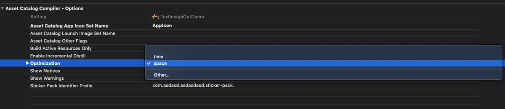

# Asset


#### 图片资源

在解压缩安装包后，我们自动从 Assets.car 中自动获取图片信息。一般我们可以通过类似这样的命令来获取到这些信息

```text
xcrun --sdk iphoneos assetutil --info ~/Desktop/Assets.car
```

这个里面会包含类似这样的图片元信息

```text
{
    "AssetType" : "PackedImage",
    "BitsPerComponent" : 8,
    "ColorModel" : "Monochrome",
    "Colorspace" : "gray gamma 22",
    "Compression" : "deepmap-lzfse",
    "DeploymentTarget" : "2018",
    "Encoding" : "Gray",
    "Idiom" : "universal",
    "Name" : "ZZZZPackedAsset-3.0.1-gamut0",
    "Opaque" : false,
    "PixelHeight" : 216,
    "PixelWidth" : 216,
    "RenditionName" : "ZZZZPackedAsset-3.0.1-gamut0",
    "Scale" : 3,
    "SHA1Digest" : "1B97AFBF5DCBD1A720356E72DD4D8D093AC0C9B3",
    "SizeOnDisk" : 3686
  }
```

#### Asset.car

在安装包构建过程中放在 xcasset 中的 png 图片会在构建的时候通过 pngcrush 来进行压缩。并最终生成 Asset.car 文件。

但因为不同的 iOS 设备 & 系统下 会使用不同的压缩算法， 有些算法压缩比高有些算法压缩比低。而在最终的 Asset.car 往往包含了针对不同系统使用的不同压缩算法压缩的图片变体。

截止目前 Xcode 12.3 \(12C33\) 会使用的压缩算法有 `lzfse`、`palette_img`、`deepmap2`、`deepmap_lzfse` 、`zip`

**以 iPhoneX 为例：**

iOS 11.x 版本：对应的压缩算法为 `lzfse`、`zip`

iOS 12.0.x - iOS 12.4.x : 对应的压缩算法为 `deepmap_lzfse`、`palette_img`

iOS 13.x : 对应的压缩算法为`deepmap2`

按照压缩比来讲 `lzfse` &lt; `palette_img` ~= `deepmap_lzfse` &lt; `deepmap2`

其中对于 iOS 12 之前的设备，编译的 Assets.car 中会存在以 lzfse 方式压缩的图片。这种压缩方式是以图片最快加载速度的初衷进行处理的所以往往压缩比很低，图片lzfse 变体的通常会比较大

#### 设置方式

通过设置 **Asset Catalog Complier - Options 中的 Optimizaiton 为 'space' lzfse 压缩算法生成的图片将会变为 zip 。相关 Benchmark 参考：**[**Asset Catalog Complier - space 图片压缩**](https://bytedance.feishu.cn/docs/doccnC7lR0TBfAn5rWhGizRCmed)

修改默认的 Asset Catalog Compiler - Options 中 Optimization 为 space 优先。



#### Cocoapods

如果使用了多Target 的方式，需要在Bundle 的Target 中加入下面的配置

```text
ASSETCATALOG_COMPILER_OPTIMIZATION=space
```

或者在 podspec 中增加

```text
s.pod_target_xcconfig = {
      'ASSETCATALOG_COMPILER_OPTIMIZATION' => 'space' # 图片编译使用空间优先
}
```

